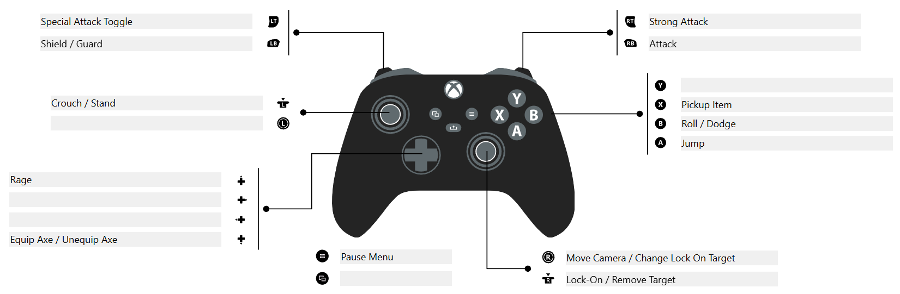
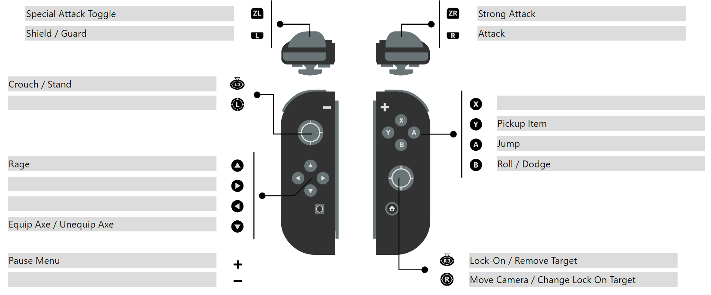

# Controls

Shokada can use either a controller or the mouse and keyboard. The default control schemes are presented below.

NOTE: In the future it is expected that Shokada will enable customization of the controls.

## Mouse and Keyboard

### Movement

* `Mouse`: Move Camera / Change Lock On Target
* `W` or ↑: Move Forward
* `S` or ↓: Move Backwards
* `A` or ←: Move Left
* `D` or →: Move Right
* `LEFT ALT` + Directional Movement: Roll/Dodge in specified Direction
* `SPACEBAR`: Jump

### Combat

* `LMB`: Attack
* `RMB`: Strong Attack
* `LEFT SHIFT`: Shield / Guard
* `LEFT CTRL` + `LMB`: Special Attack
* `LEFT CTRL` + `RMB`: Special Heavy Attack
* `RMB`: Strong Attack
* `MMB`: Lock-On to the closest target / Remove Lock-On Target
* `R`: Trigger "Rage" state

### Movement

* `E`: Pickup Item
* `ESC`: Pause Menu

## Xbox Series X Controls

## Playstation 5 Controls

